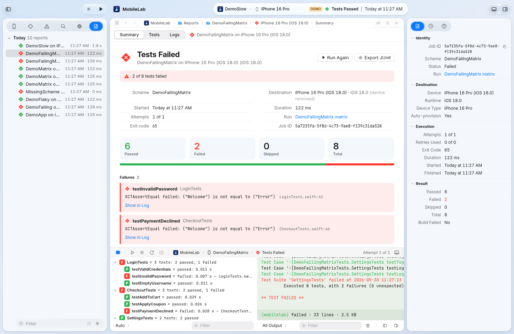
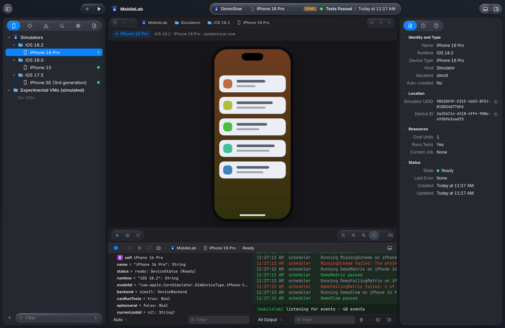
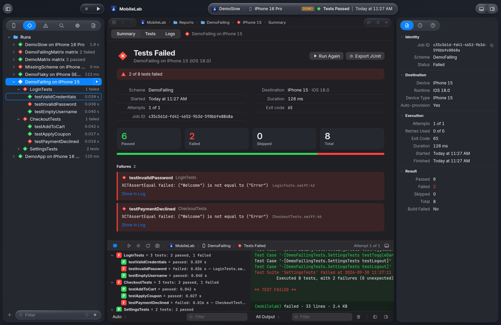
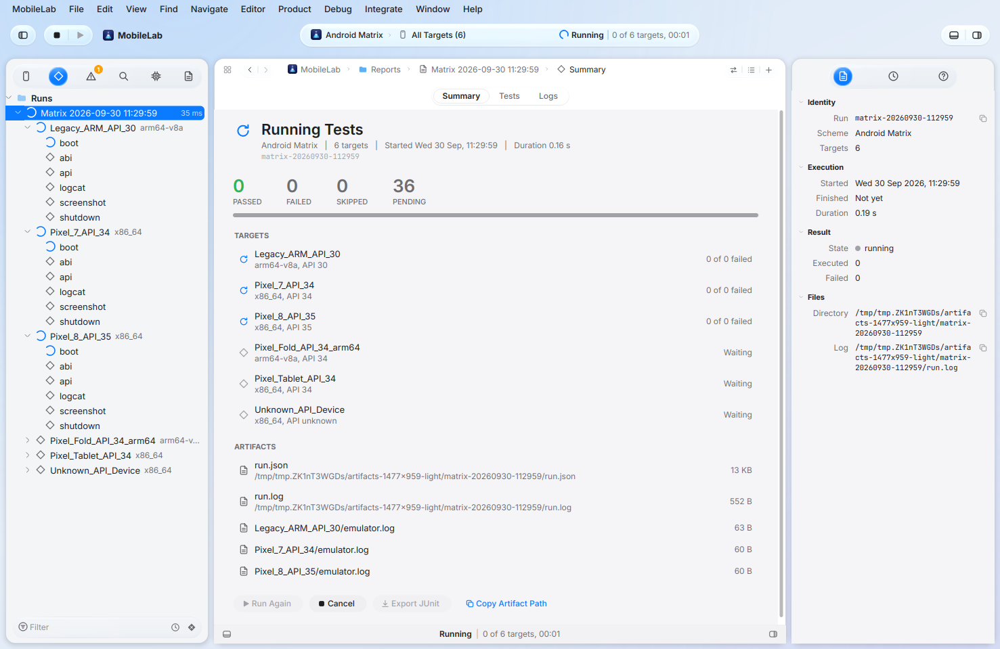
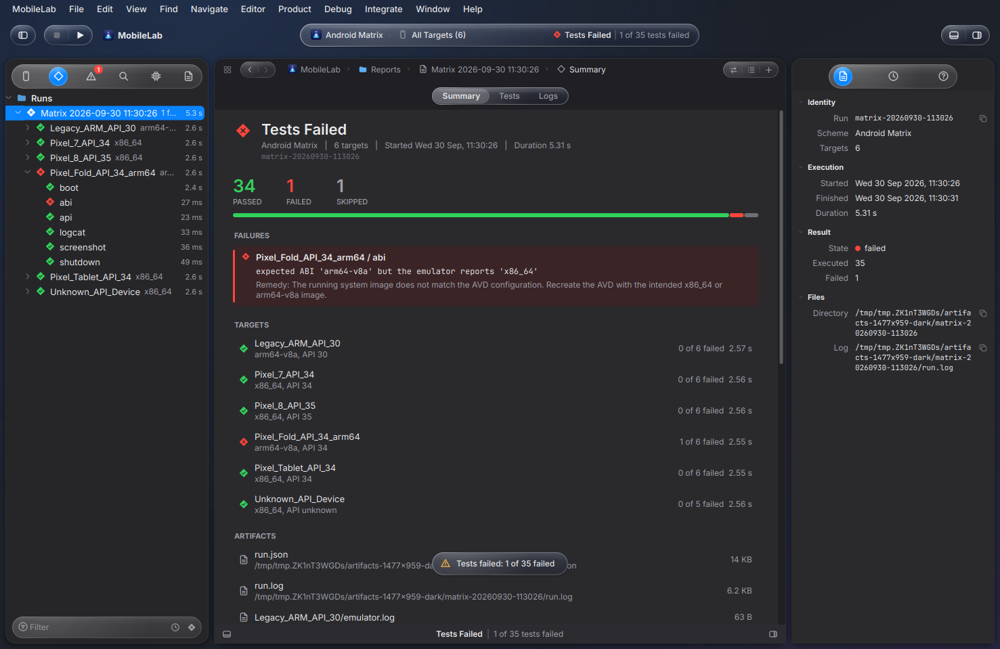
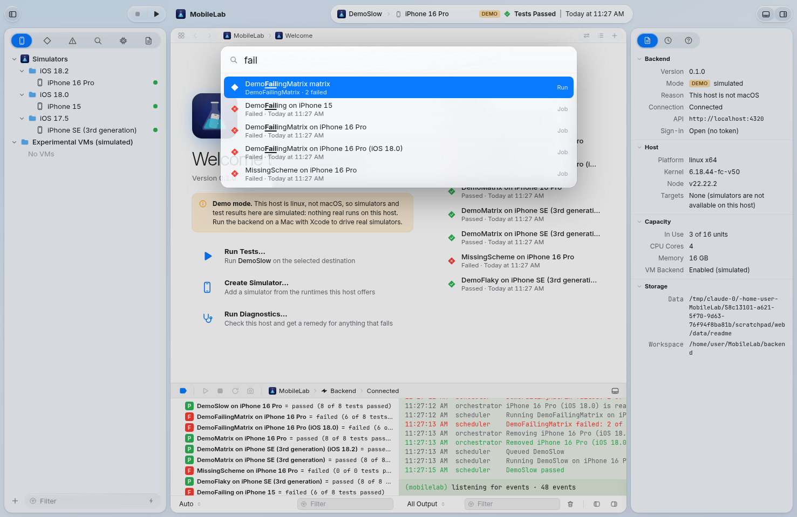
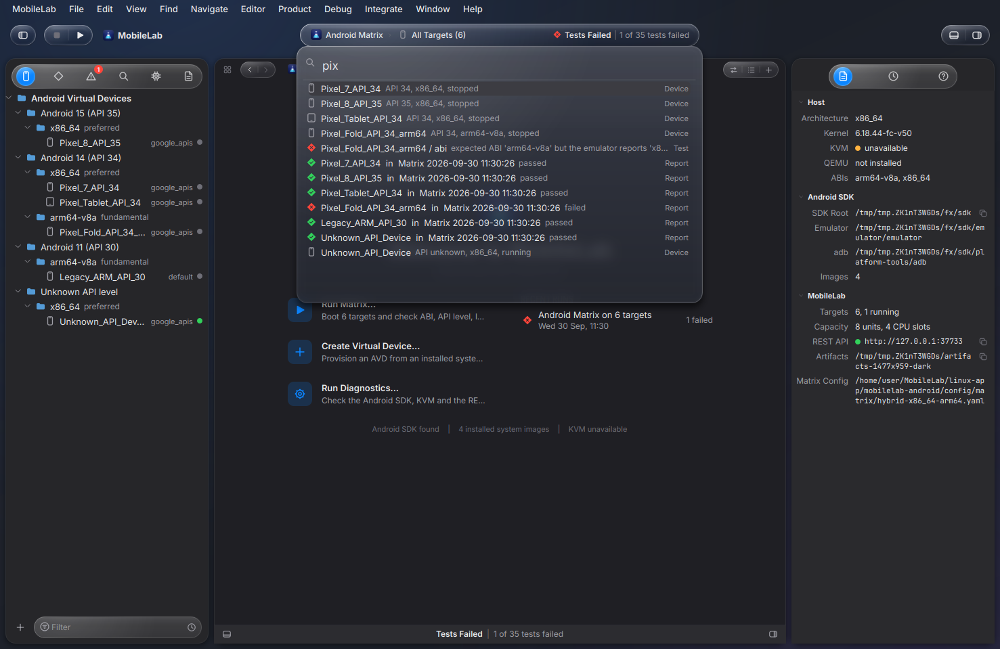

<p align="center">
  
</p>

<h1 align="center">MobileLab</h1>

<p align="center">
  A device lab for mobile tests: a pool of simulators and emulators, a job queue, live logs and<br>
  parsed results, behind one API, a CLI and an Xcode-style dashboard.
</p>

<p align="center">
  <a href="https://github.com/ducminh1110/MobileLab/actions/workflows/ci.yml"></a>
  <a href="https://github.com/ducminh1110/MobileLab/releases/latest"></a>
  <a href="LICENSE.md"></a>
  
</p>

<p align="center">
  
</p>

MobileLab started as **iOSLab** (run many iOS Simulator test combinations in parallel on one Mac). Some
identifiers in the repository, such as the `ioslab` command and `IOSLAB_*` variables, still carry the old name
on purpose so existing setups keep working. It is the same project.

## What it does

- **Runs `xcodebuild test` on simulators** and keeps the queue moving: a dispatcher assigns each job to a
  matching ready device, boots or creates simulators on demand and removes the ones it created afterwards.
- **Matrix runs**: one scheme across several iOS versions and device types, with a parallelism limit. Combinations
  that cannot exist (a new iPhone on an old iOS) are skipped and reported instead of failing later.
- **Results you can read**: XCTest and Swift Testing output is parsed into test cases, failures link to the
  log line, and every job can be exported as JUnit XML.
- **Live everything**: logs and lifecycle events stream over WebSocket and Server-Sent Events.
- **Resource aware**: each booted device costs capacity units, so a laptop is not asked to boot twenty simulators.
- **Retries and cancellation** with backoff; build errors are never retried because they are deterministic.
- **One API, several clients**: REST, an [MCP](https://modelcontextprotocol.io) endpoint for AI assistants, a CLI,
  a web dashboard and native apps.
- **Honest about what it is running**: off macOS the backend starts in *demo mode*, which simulates `simctl` and
  `xcodebuild`, and every client labels it as such.

## Interfaces

All of them follow the layout of Xcode 26 (navigator, editor, inspector, debug area, scheme capsule,
Open Quickly) with the Inter typeface, light and dark, and a Liquid Glass look drawn by the project itself.

| | |
| --- | --- |
|  |  |
| Web dashboard: simulator with live screenshot | Web dashboard: test tree with failures |
|  |  |
| Linux app (Qt 6): Android matrix in progress | Linux app: report with the failing ABI check |
|  |  |
| Open Quickly (Cmd/Ctrl+Shift+O) in the web dashboard | The same in the Linux app |

## Get started

**Backend and dashboard** (Node 20 or newer, any OS):

```sh
git clone https://github.com/ducminh1110/MobileLab && cd MobileLab
make setup          # installs backend and CLI dependencies
make demo           # demo mode, works anywhere; open http://127.0.0.1:4000
```

On a Mac with Xcode, `make dev` drives real simulators. Run `ioslab doctor` (or open Settings in the
dashboard) to see what the host is missing and how to fix it.

**CLI**:

```sh
cd cli && npm run build && npm link
ioslab status
ioslab test run MyAppTests --project MyApp.xcodeproj --runtime 18.0 --runtime 17.5 --junit results.xml
ioslab test list && ioslab test show <job>
```

**Linux app** (Android device lab, Qt 6), from the [latest release](https://github.com/ducminh1110/MobileLab/releases/latest):

```sh
sudo apt install ./MobileLab-linux-amd64.deb     # Debian, Ubuntu
# or, on any x86_64 distribution with Qt 6:
tar xzf MobileLab-linux-x86_64.tar.gz && ./mobilelab-android/bin/mobilelab-android
```

## Components

| Directory | What it is |
| --- | --- |
| [`backend/`](backend) | Fastify + TypeScript server: orchestrator, `simctl`/`xcodebuild` engine, parsers, API, MCP, metrics, and the web dashboard in `backend/public`. |
| [`cli/`](cli) | The `ioslab` command. |
| [`linux-app/mobilelab-android/`](linux-app/mobilelab-android) | Qt 6 app for Android virtual devices and matrix runs (AVD, Waydroid, hybrid x86_64 + ARM64). |
| [`macos-app/`](macos-app) | SwiftUI app. Its logic lives in a SwiftPM library that is tested on Linux. |
| [`shared/fonts/`](shared/fonts) | Inter and JetBrains Mono, both under the SIL Open Font License. |

## Documentation

- [API reference](docs/api.md): every endpoint, status code and environment variable
- [Architecture](docs/architecture/README.md)
- [Xcode interface notes](docs/design/xcode-interface.md) and [Liquid Glass](docs/design/liquid-glass.md)
- [Connecting to a remote Mac](docs/design/remote-mac.md) (design only, not built yet)
- [ARM64 Linux](docs/arm64-linux.md)
- [What to do next](docs/NEXT_STEPS.md)

## Status

Stated plainly, because a device lab is only useful if you know what has been exercised:

| Part | State |
| --- | --- |
| Backend, CLI, web dashboard | Tested in CI on Node 20 and 22, against a simulated `simctl`/`xcodebuild`. |
| Real simulators | The `simctl`/`xcodebuild` path has **not yet run on a Mac**. Expect rough edges. |
| Linux app | Built and tested in CI against a fake Android SDK; released as `.tar.gz` and `.deb`. Real emulators need KVM. |
| macOS app | In progress. The Core library is tested; the SwiftUI project does not build in CI yet. |
| Windows | Not planned for now. |

## Development

```sh
make help      # list the targets
make check     # type-check backend and CLI
make test      # run the Node tests
```

CI runs on every pull request: Node tests, the Linux app build and tests, and the macOS build.
Tagged releases publish the backend, the CLI and the apps.

## License

[MIT](LICENSE.md). Inter is licensed under the SIL Open Font License 1.1, as is JetBrains Mono.
